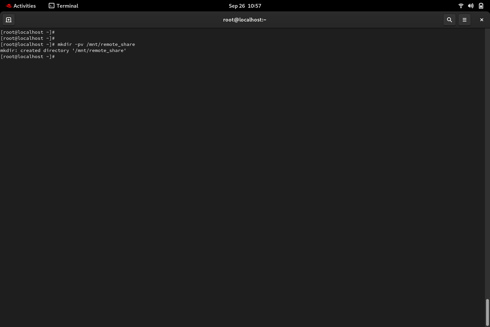

### MANUAL NFS SERVER

\*\*Priority Level\*\*: HIGH

\*\*Estimated Time\*\*: 20 minutes

\*\*Required Access\*\*:

\*\*Risk Level\*\*:

#### Description

Configuring a Network File Sharing Server (NFSv4) a local network.

#### Platform → RedHat

#### Prerequisites

\- Server-Client Architecture

\- Install Required Packages

BASIC INSTALLATION SETUP SERVER SIDE:

1\. Update computer packages List and Install the nfs package:

-   dnf update -y
-   dnf install nfs-utils -y

2\. Start the server and check the status

-   systemctl start nfs-server
-   systemctl status nfs-server
-   systemctl enable –now nfs-server

3\. Configure exports

Create and configure the directories you want to share with the clients.
This is done by editing **/etc/exports.d, **and create a drop-in file to
share:

**vim /etc/exports.d/shared_directory_name** and edit specifying:

1.  Directories to be shared
2.  Target client
3.  Permissions assigned

4\. Create directories specified in the previous step:

-   mkdir -pv / shared_directory_name

5\. Add files to be shared:

cd ** / shared_directory_name**

** **cp \~/Documents /shared_directory_name -r

6\. Check and Set correct Selinux Context

ls -z /shared

Assign the public_contect_t or nfs_t type (commonly used for NFS
exports)

semanage fcontext -a -t nfs_t “/shared()”

restorecon -Rv /shared

6\. Re-initilaize the nfs services

-   exportfs -r
-   exportfs -v

7\. Show the mounted directories

showmount -e

6\. Allow firewall rules, NFS-related services and reload firewall :

firewall-cmd --permanent --add-service=nfs

firewall-cmd –reload

7\. verify the firewall rules are updated:

firewall-cmd –list-all

You should see the following:

**BASIC INSTALLATION SETUP CLIENT SIDE**

1\. Update computer packages List and Install the nfs package:

-   dnf update -y
-   dnf install nfs-utils -y

2\. Create a mount point for a shared directory

-   **mkdir -pv /mnt/remote\_share**

3\. Mount the shared_directory using fstab file: **vim /etc/fstab**

4\. start the nfs service: systemctl start nfs-utils.service

5\. Mount it persistently and confirm if the shared_directory is
mounted.:

-   mount -av

-   ls /mnt/directoty_name

